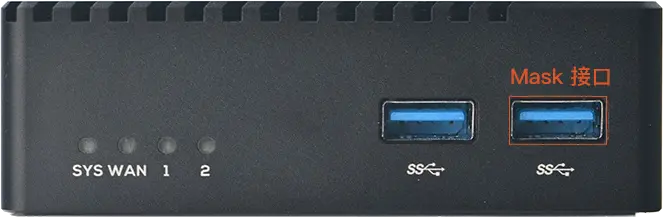
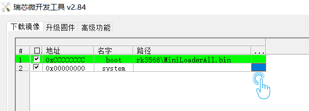
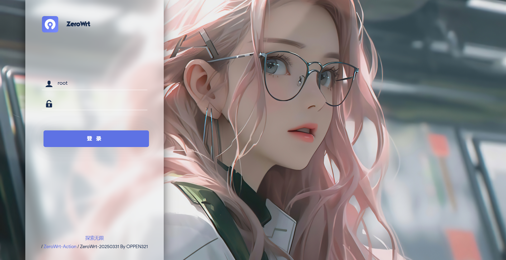
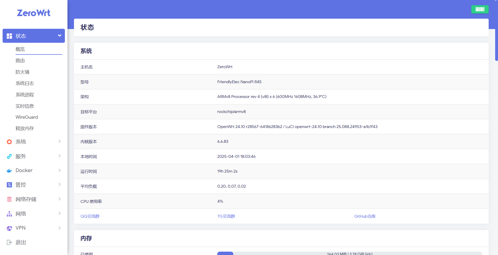
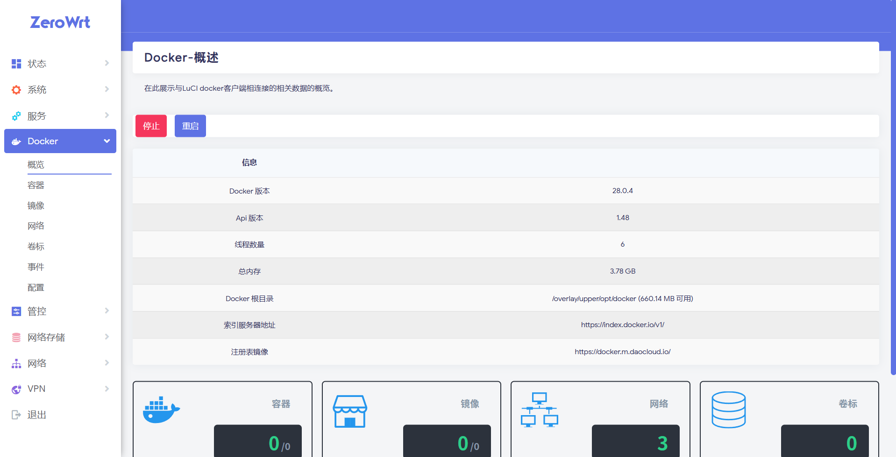
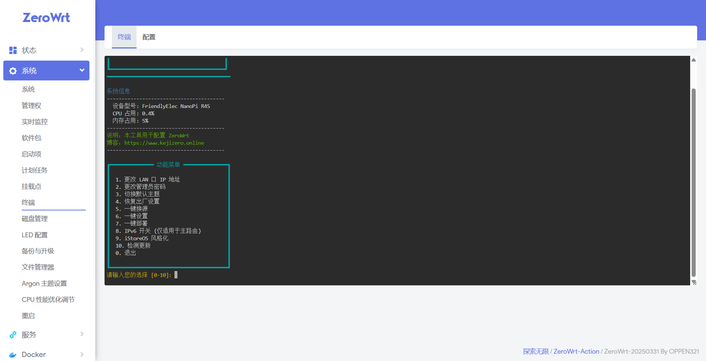

<div align="center">


**High-performance firmware built on [OpenWrt](https://github.com/openwrt/openwrt), supporting Rockchip, X86_64, Mediatek, and Qualcommax platforms - designed for advanced users!**  

</div>

---

I18N: [English](README_EN.md) | [简体中文](README.md) 

## 🔍 Firmware Overview 
- 🛠 **Source Base**: [OpenWrt Official]
  - Rockchip, X86_64, ARMv8: Based on [OpenWrt Official](https://github.com/openwrt/openwrt)
  - Mediatek: Based on [Padavanonly](https://github.com/padavanonly/immortalwrt-mt798x-24.10)
  - Qualcommax, Bcm27xx, Bcm53xx: Based on [Lede](https://github.com/coolsnowwolf/lede)

- 🔧 **Default Settings**:
  - Admin Address: `10.0.0.1`, Password: `password` or blank
  - Web Terminal and SSH accessible via all LAN ports
  - Firewall protection enabled on WAN by default
  - Docker configured with China-optimized sources and image acceleration

- 🚀 **Enhanced Support** (x86_64 / Rockchip):
  - GPU hardware acceleration
  - BBRv3 congestion control
  - Shortcut-FE UDP inbound support
  - NAT6 and Full Cone NAT (NFT / BCM solutions)

- 🎛 **Feature Optimizations**:
  - Built-in ZeroWrt settings menu for easy management
  - Supports advanced plugins and custom startup scripts

---

## 💾 ZeroWrt Firmware Burning (SD)

**Recommended Tool:**<a href="https://www.balena.io/etcher/" target="_blank" ></a>

**SD Card Requirement: 2GB+ capacity**

*Write firmware files directly to microSD card without extraction*

---

## 🛠️ Firmware Burning Guide

### 📦 Preparation
- **Computer (Windows required, other OS users find tools independently)**
- **USB Cable: USB-A to USB-A or Type-C to USB-A**
- **Rockchip Tools:**<a href="https://github.com/zhiern/OpenWRT/raw/refs/heads/openwrt-24.10/date/RKDevTool_Release_v2.84.zip" target="_blank" >RKDevTool_Release_v2.84.zip</a>
- **MaskROM Driver:**<a href="https://github.com/zhiern/OpenWRT/raw/refs/heads/openwrt-24.10/date/DriverAssitant_v5.1.1.zip" target="_blank" >DriverAssitant_v5.1.1.zip</a>

### 📥 Firmware Preparation
- **Download firmware and extract the .img file**

### 🚀 Procedure
1. **Install MaskROM driver**
2. **Connect device in MaskROM mode**:
   - Power off R5S and remove SD card
   - Connect to computer via USB cable
   - Press and hold "Mask" button
   - Power on R5S while holding button
   - Release "Mask" after computer detects new device
   

3. **Open Rockchip Development Tool**:
   - Normal status: "Maskrom device found"
   - Driver issue: "No devices detected"
   
   **Installation Steps**:
   
   **① Click "system" path button → Select extracted .img file**
   
   
   
   **② Click "Execute" (Device will auto-reboot into OpenWrt after flashing)**

- ***Important: Use only the provided [Rockchip Tool](https://github.com/zhiern/OpenWRT/raw/refs/heads/openwrt-24.10/date/RKDevTool_Release_v2.84.zip) for flashing.***

---

## 📤 Flashing to eMMC (SD to eMMC)

```shell
# 1. Boot from SD card with latest firmware
# 2. Upload firmware to /tmp via Xftp or download using wget:
#    wget -P /tmp [firmware_download_url]

# 3. Write to eMMC (replace with actual filename):
emmc-install /tmp/xx-squashfs-sysupgrade.img.gz
```

**After completion, remove SD card and power cycle the device.**

------

## 📂 Firmware Preview

<div align="center">

  
  
  


</div>

---

## 💬 Chat Group and Support

If you have any technical questions or want to exchange usage experience, you can join our discussion group:

- 🧧 QQ chat group：579896728 👉 [Click to join](https://qm.qq.com/q/oe4EAtvPIO)
- 🌐 Telegram group 👉 [Click to join](https://t.me/kejizero)

---

## 💰 Tip support

Thank you for your support, we will use every reward to improve services and development. **Reward more than 20 yuan to get VIP area access！**

👉 [Click to tip](https://pay.kejizero.online)

---

## 🏆 Acknowledgments [](#Acknowledgments-)
| [ImmortalWrt](https://github.com/immortalwrt) | [coolsnowwolf](https://github.com/coolsnowwolf) | [P3TERX](https://github.com/P3TERX) | [Flippy](https://github.com/unifreq) |
| :-------------: | :-------------: | :-------------: | :-------------: |
|  |  |  |  |
| [sbwml](https://github.com/sbwml) | [SuLingGG](https://github.com/SuLingGG) | [QiuSimons](https://github.com/QiuSimons) | [padavanonly](https://github.com/padavanonly/immortalwrt-mt798x-24.10) |
|  |  |  |  |

---

## ⚠️ Disclaimer

> - This firmware is for study and research only, please do not use it for commercial purposes 
> - All consequences of using this firmware are borne by the user
> - There is no guarantee that it is completely bug-free, and the developer does not provide customization support  
> - Please comply with national cybersecurity laws and regulations
